# Final Projects

This is some basic, sample markdown.

## Project 1: Gradient Domain Fusion

With this project we are trying a new kind of blending. The intuition is that when you look at an image, the content comes from the lines, the edges, etc... the GRADIENTS of the image. If we want to put an object from one image into another image, the key insight is that we should try and implant not the pixel values of our target, but the GRADIENTS from the source image into our target image that will receive the new object. In this way, we implant all the correct lines and whatnot in the targeted image, and since we are just modifying the gradients, we can try and keep the edges of the implanted area the same as the surrounding pixels, removing any gross lines that can occur at the border of images, without any kind of feathering needed.

Here is the equation that we are trying to optimize. V is pixels in and adjacent to our region of implanting. In the first sum, we want to minimize differences in gradient between V and S (our source image which contains the object we are implanting). In the second sum, for all the pixels bordering our object region, we want the gradient between T (our background or target image) and the pixels in the region V to be the same as in the source image S. Basically, we want all the gradients in our new image in and next to the implanted region to match the gradients of the object being implanted.

For notational clarity as this tripped me up at first, i is a pixel in S, j is a 4 neighbor of i that is in S, and to be clear, in the second sum, we take j over all the 4 neighbors of i NOT in S.

We can solve this with least squares since each of the terms in the sum we hope to minimize can be considered rows in the least squares objective |(Ax-b)|2.

### Part 1:

Here we will solve a toy problem that mimics some of the complexity of the actual optimization problem. We will basically just start with the first problem. We will take one image and create a least squares optimization that constrains that in our solved for new image, the gradients are exactly the same as in the source image everywhere, and also the top corner pixel has the same value. Ideally this gets us back our input image.

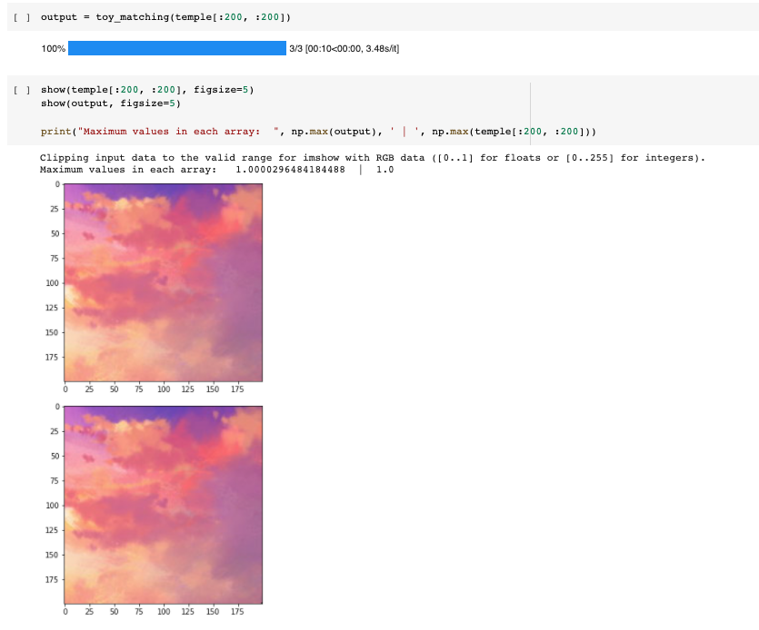

Here is the output from that problem. You can see that in the output image, there is no discernable difference. That being said, likely due to some numerical precision issues, there were slight pixel differences on the order of 1e-5, which is small enough to not worry about, given that pixel values at the beginning are binned with increments of 1/256, much larger than 1e-5 and certainly much smaller than we can perceive.

### Part 2:

Here we will solve the whole optimization problem. Basically, for each pixel in S (for all i) we will look at all of the 4 neighbors, and if the neighbor is in S, we will create an equation corresponding to the first sum, and if the neighbor isn't in S, we will create an equation corresponding to the second sum. Thus we get 4 * |S| equations to solve.

Here are some of our starting images we will be using:

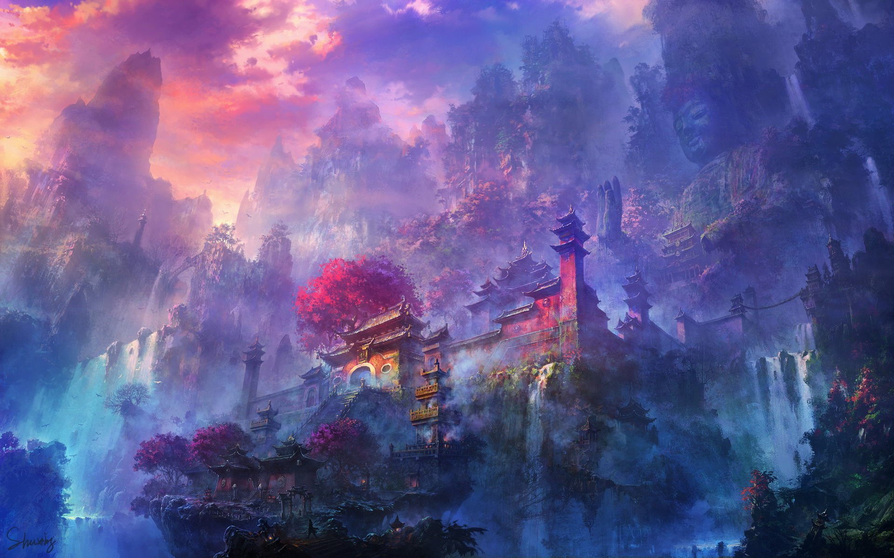
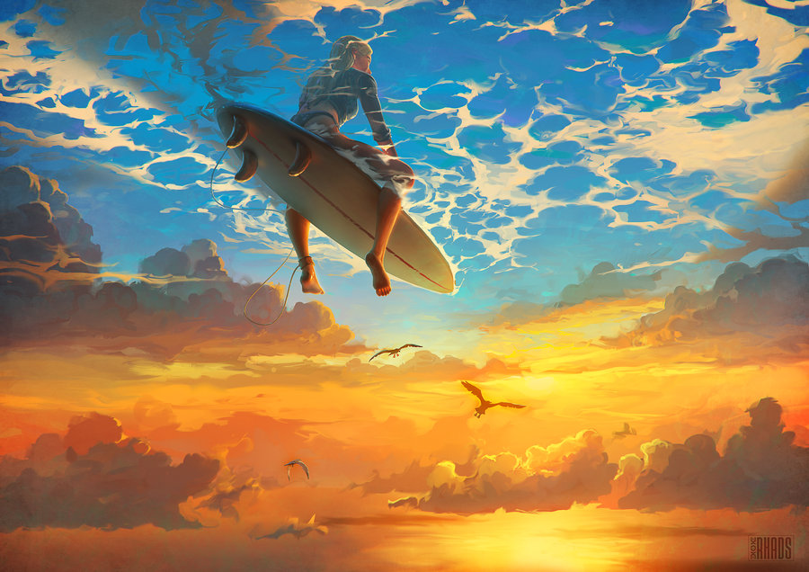

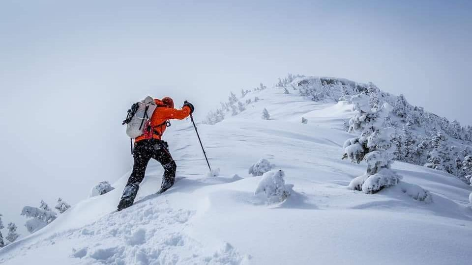
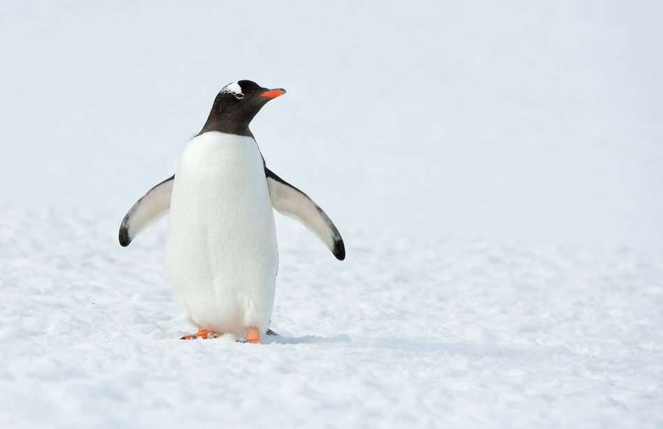

Here are some outputs:

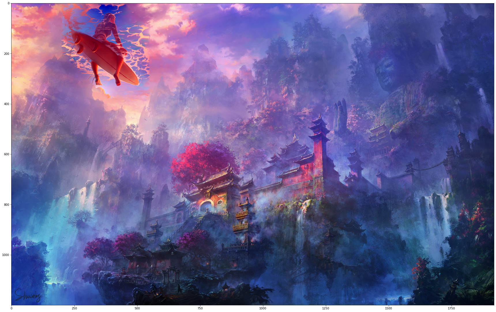

Here, we have blended the surfer into the temple image. This is somewhat of a failure mode. You can see that in the surfer image, there is a lot of seafoam creating a strong gradient along the edge of our mask in the direction of the edge. This becomes hard to match in our optimization problem as there is a great deal of change along the border. Hence, the blending at the edge isn't fantastic. That being said, it could be a lot worse, and the colors tend to match up nicely in areas of low change like around the top. We also see one of the flaws of this method which is that matching the color in the original image is COMPLETELY ignored. The surfer went from a blue shirt and orange surfboard to a pink/purple shirt and pink surfboard. This is less than ideal, but we will get to that later.

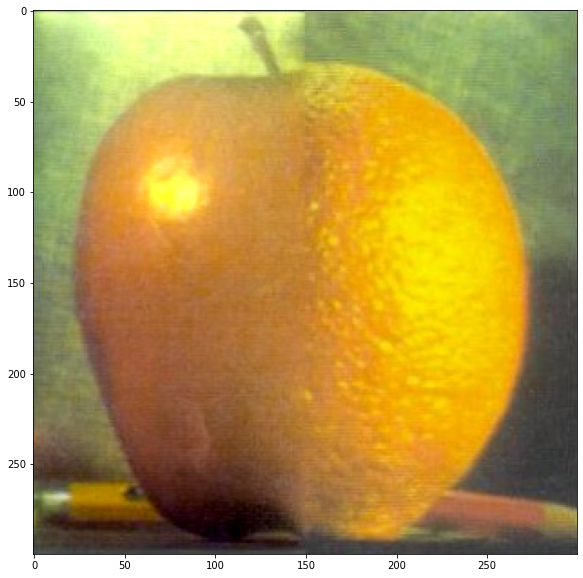

Here we can compare this blending to the blending that we did in project 2. In our blending, there is definitely an edge. It isn't gross, but if you squint, you can see a faint edge at the bottom, and at the top where the backgrounds are different. I think this highlights another flaw with this method: our optimization method has to try and blend parts of the image we don't care about. Our system of equations is overdetermined (more equations than variables) and so every time we add new constraints, in order to minimize error for the new constraint, we have to sacrifice some accuracy in satisfying our old constraints. Here, we had constraints corresponding to the top of the image, where backgrounds are bordering each other. We sacrificed some accuracy along the border of the fruits to satisfy the constraints created by the bordering backgrounds, which we don't really care about as much. We have less agency with this method to pick and choose what is important to us, and finding the things in particular that we want to match up.

You can see that overall, this method does ok, but doesn't come close to the frequency based feathering we did in project 2 (see below).

The blending in this original orapple from project 2 has feathering over a much larger area. Some insight that we can take from the differences in these results is that we should perhaps implement a feathered mask which has values inside it to weight our constraints by importance, allowing us to get a cleaner blend over the edges of the images. In regions where the mask is fractional, we would need to add weighted terms corresponding to BOTH of the summations. I don't do this, but it would have been a fun thing to try out.

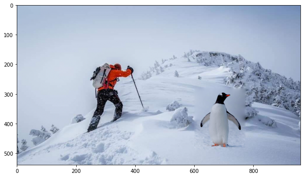

This is another failure mode due to poor mask creation. The blending here along the bottom is excellent, where the background of both images match. The blending where the mask of the penguin meets the tree on the mountainside is really bad. This highlights that at the end of the day, if you want to do this method, you will still need to clip the object in question tightly if you are trying to implant an object into a background with high frequency information.

### Bells and Whistles:

To try and combat one of the issues with this method: it's ignorance of intensity values in your original object, I tried to add weighted constraint terms that would add a penalty for the model if the pixels in the new are V didn't match the pixels in the original image S. By weighting the terms, I am allowed to control the degree to which we pay attention to the intensity values.

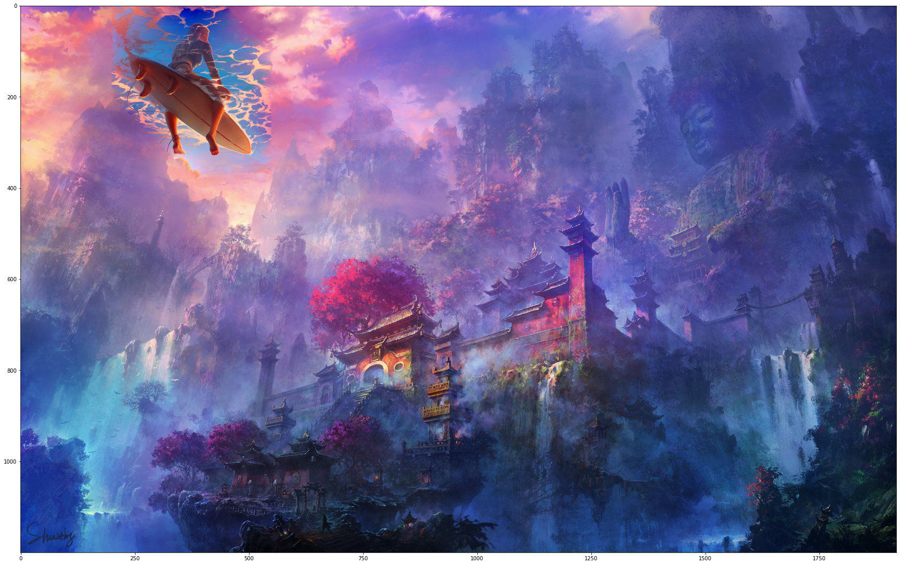

This is so much better. Here, we actually get some of the light blues back in the shirt and in the sky that we had in the original image, while still getting some nice reds from the background image put on the seafoam. Controlling this weighting is really powerful and allows me to try and get the best of both worlds, by trying to get the model to modify the gradients to eventually get us back to the intensity values in the source image.

The blending issues still persist, but the color is so much better.

## Project 2: Neural Style Transfer

With this project, our objective is to transfer the artistic style of one image onto another image, our content image. The inspiration here is that pretrained image classification networks start by cascading textures basically. The lowest level features in a pretrained convnet are recognizing texture, cascading those textures to get higher level features that recognize the objects themselves that are being created from the textures. The deeper you go into a network, the more advanced the features are, going from brushstrokes, to shapes, to objects.

We are going to take an input image, and try to constrain that when passed through a pretrained convnet, it's earlier activations match the activations from a style image, and its later activations match the activations of the content image. Specifically for style activations, we will try and match GRAM matrices of input and style image, which is a matrix of correlations for feature maps at that layer.

We can define a loss in this way on our original image, and all we need to do is backpropagate back onto our input image and update the pixel values with gradient steps.

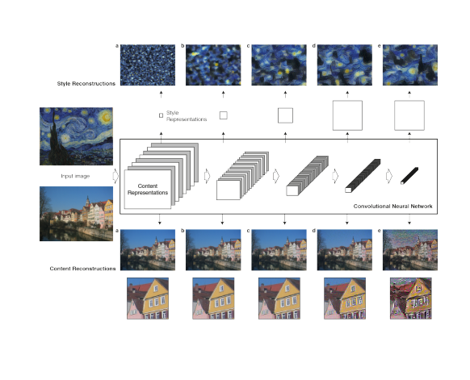

This image above shows how as you go deeper into the network, what you are able to reconstruct by trying to match that layer's gram matrix (if style) or regular activations (if content).

You can see that as you choose later and later layers for style, you reconstruct larger stylistic details like swirls and waves, and later layers for content, you start to only really capture the main details and outlines of images.

I took a pretrained VGG-19 as the paper said to do, and chose the same layers that they did. My results were good, but could have been better. I think most of the transferred style was low level stuff, meaning I should have increased the weights on later style layers and decreased the weights on earlier style layers.

Here is our input / content image.

Here are our style images.

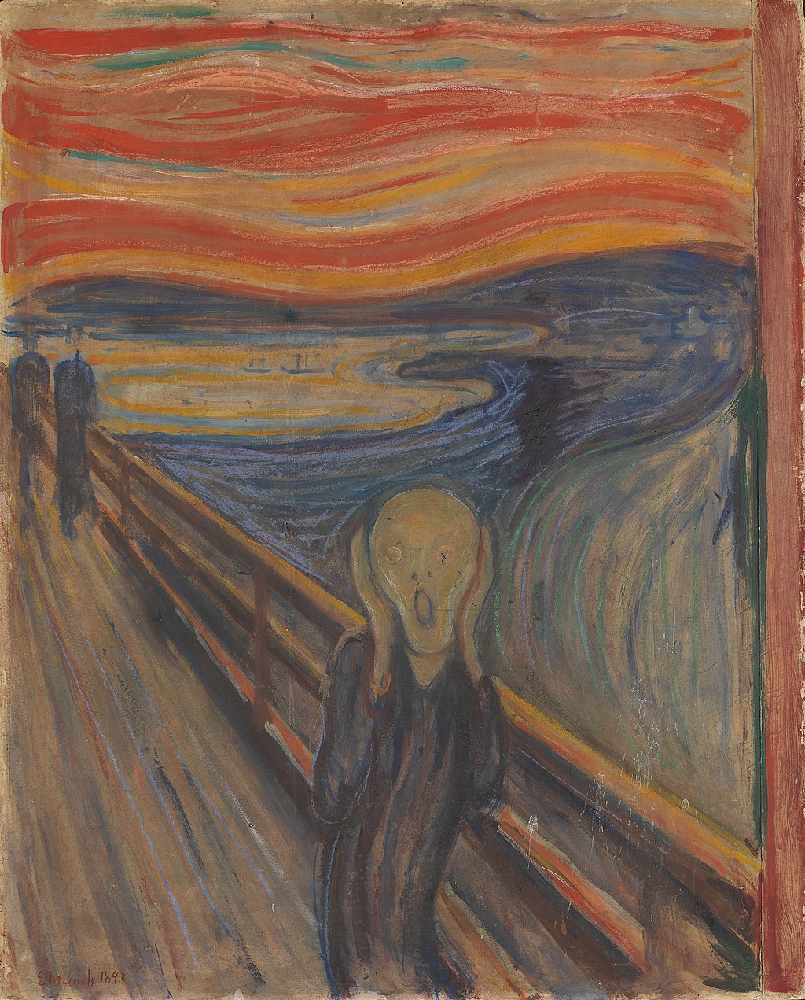

Here are our output images.

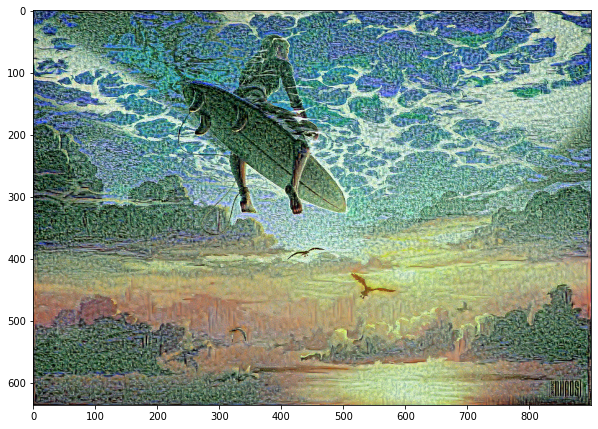
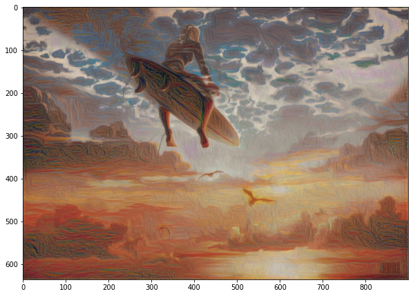
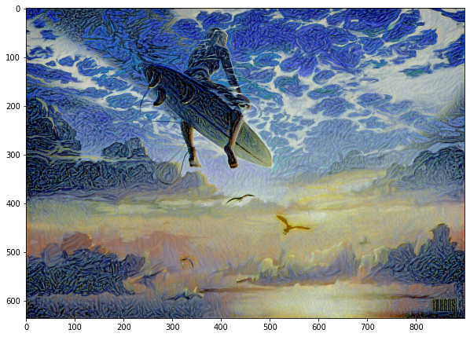

These do capture the colors, and the brush stroke types (more points for monet and strokes for starry night and scream). We also see some smaller, nicer swirls in the starry night surfer, like in the actual image, but they certainly aren't as good as in the actual starry night painting, indicating again that I put not enough weight on the later style layers.

My parameters were that I used even weights on all the layers, removed the N * N * M * M constant in the style layer to get it to train faster, used Adam optimizer with lr = .004, and used activations from the end of each convolutional block in the VGG-19 pretrained network.
